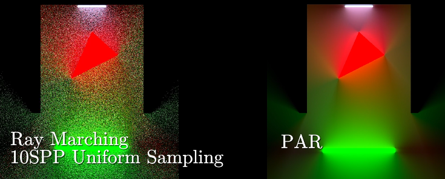
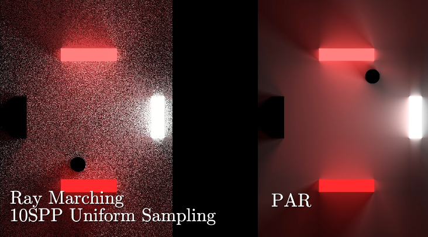

<div align="center">

<h1> PAR : Probabilistic Angle Shading  </h1>

<h3> A low-cost way to render direct light in 2D scene  </h3>


</div>

This repository is a reference code for the PAR method.

To get start, cloning this repository in following command:

```bash
git clone --recursive https://github.com/FSMargoo/PAR.git
```

Then build project by CMake in any way you like.

Four scenes are available in four executable files given in CMakeLists.txt.

## Visual Comparison

The following comparison are running under NVIDIA GeForce 4050 Laptop GPU under resolution 1920x1080. The Ray Marching method costed about 15ms to render a frame in 10SPP while PAR only used 5ms to render a frame with even higher quality in the second comparison.

<div align="center">




</div>

## Method Introduction

A $\LaTeX$ document is provided in this repository for the reference.

## Reference Videos

Some reference videos are available on following link:

1. [Comparison to the Ray Marching](https://www.bilibili.com/video/BV1GMaqzsEW4/)
2. [Dynamic Scene Show Case](https://www.bilibili.com/video/BV1fkhvzbEy9/)